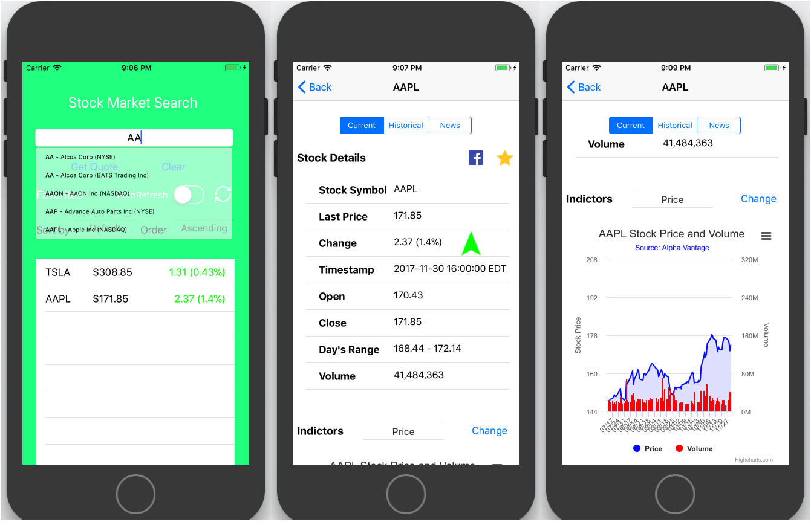
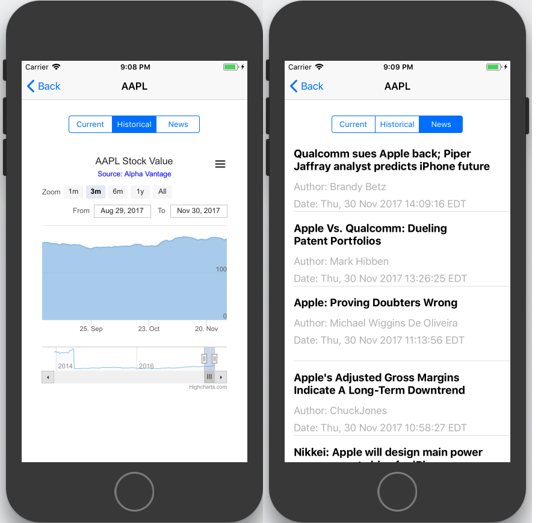

## Search Stock

This is an app developped for stock searching. The main interface is shown as below:

## Installation

- `git clone https://github.com/GeorgyZhou/iOS-Stock-App`
- `cd iOS-Stock-App`
- `pod install`

and then the program can run.

## Acknowledgement

- Data source: [Alphaventage](https://www.alphavantage.co/)
- Charts presenting: [HighCharts](https://www.highcharts.com/)
- Stock News Data source:  [Seekingalpha](https://seekingalpha.com/)
- Others: [EasyToast](https://cocoapods.org/pods/EasyToast), [SearchTextField](https://github.com/apasccon/SearchTextField), [SwiftSpinner](https://github.com/icanzilb/SwiftSpinner)